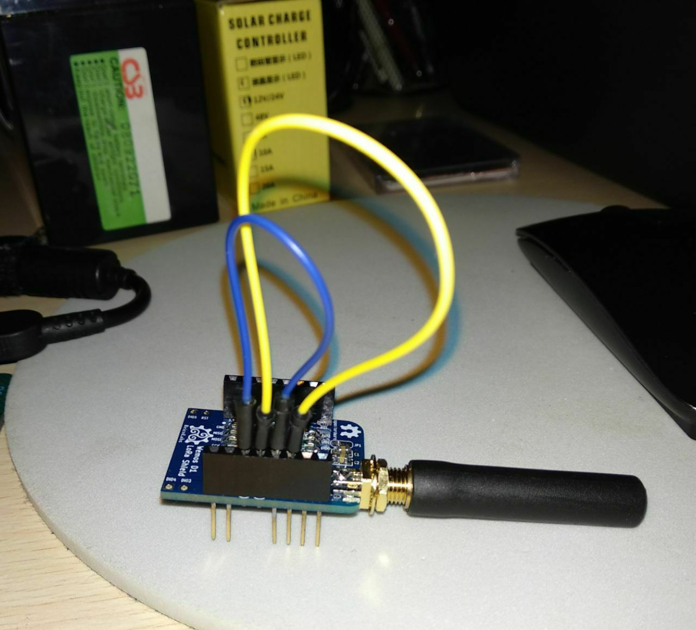

# TTN node

Compilable with [Platformio](https://platformio.org) and tested with ESP8266 and
[BricoLabs ESP8266 LoRa shield Shield for Wemos D1](https://github.com/brico-labs/LoRa/tree/master/WorkshopOSHWDem18/BricoLabs_ESP8266_LoRa_shield)

## Instructions:

Edit ```src/ttn-node.cpp``` and modify around line 50 according your TTN node data:

- NWKSKEY
- APPSKEY
- DEVADDR 

## Hack the LoRa shield

1. Blend D3 and D4 pins to avoid insert them in the Wemos D1.
2. Put a jumper wire connecting D3 and D1 pin headers.
3. Put a jumper wire connecting D4 and D2 pin headers.



## Compile and upload:

    pio run -t upload


